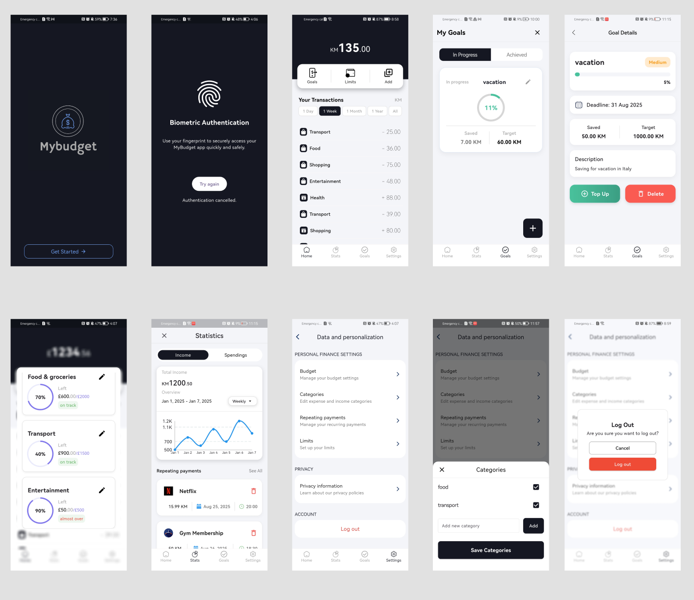

# 💰 MyBudget

MyBudget is a personal budgeting app built with **Flutter** and **Cubit (BLoC)** for state management.  
It helps users track expenses and income, set category limits, and manage recurring payments — all with secure local storage.

---

##  Features

- **Add Transactions** – Record expenses and income easily.
- **Category Management** – Create and organize categories.
- **Category Limits** – Set spending limits for each category.
- **Local Storage** – Secure offline data storage with **Hive**.
- **Biometric Authentication** – Protect access using fingerprint/biometric login.
- **Statistics & Reports** – View spending and income insights with charts.
- **Goals Tracking** – Set financial goals and monitor progress.
- **Repeating Payments** – Automate recurring expenses and incomes.

---

##  Tech Stack

- **Flutter** 
- **Cubit (BLoC package)** – Lightweight state management solution that follows the BLoC (Business Logic Component) pattern.  
  - Used to handle transactions, category limits, goals, and repeating payments in a predictable way.  
- **Flutter Hooks** – Simplified stateful logic management without boilerplate.  
  - Used for controllers (e.g., text editing, animations) and managing widget lifecycle  
- **go_router** – Declarative routing package for Flutter.  
  - Manages navigation and deep linking in a type-safe way with a central router configuration.  
- **Hive** – Fast, lightweight NoSQL database for Flutter.  
  - Used for local persistence of transactions, budgets, category limits, and goals.  
- **Biometrics (Fingerprint / Face ID)** – Integrated authentication layer for secure app access.  
- **intl** – Used for date and currency formatting throughout the app.  
- **Charts / Visualization (e.g. `fl_chart`)** – For displaying income and spending statistics with clear visual insights.  

---

## 📸 Screenshots

Here is an example of the app:

👉 More  screens are available on the following Figma link:  
[Figma Project Link](https://www.figma.com/design/ePkDTiwM1Uf4oSEwAAXrHL/CashSavvy?node-id=0-1&p=f&t=xidUCx2aRn437iV7-0)

